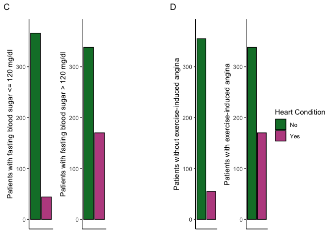
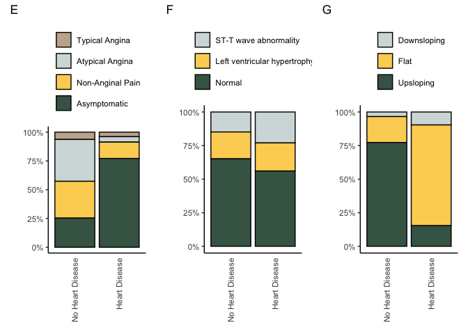

``` r
library(ggplot2)
library(hrbrthemes)
library(scales)
library(waffle)
library(ggthemes)
library(dplyr)
library(patchwork)
library(gridExtra)
library(ggpubr)
```

# Data importation and curation


```{.r .fold-show}
data = read.csv("heart.csv", stringsAsFactors = T)
data$HeartDisease <- as.factor(data$HeartDisease)
data$FastingBS <- as.factor(data$FastingBS)
data$Cholesterol <- NULL 
```

The Cholesterol column bas been removed because many 0 within population with Heart disease. Biologically, a Cholesterol level cannot be equal to 0, probably NAs values that have been replaced with 0. 

To use this column next time, a benchmarking has to be done with the different models created with the following options :

  * Rows with Cholesterol = 0 removed.  
  * Replace 0 values with the mean.  
  * Replace 0 with the median.  
  * Replace 0 values using the k-mean algorithm.
  
Observe prediction results and choose the best option. 


```{.r .fold-show}
summary(data)
```

```
##       Age        Sex     ChestPainType   RestingBP     FastingBS  RestingECG 
##  Min.   :28.00   F:193   ASY:496       Min.   :  0.0   0:704     LVH   :188  
##  1st Qu.:47.00   M:725   ATA:173       1st Qu.:120.0   1:214     Normal:552  
##  Median :54.00           NAP:203       Median :130.0             ST    :178  
##  Mean   :53.51           TA : 46       Mean   :132.4                         
##  3rd Qu.:60.00                         3rd Qu.:140.0                         
##  Max.   :77.00                         Max.   :200.0                         
##      MaxHR       ExerciseAngina    Oldpeak        ST_Slope   HeartDisease
##  Min.   : 60.0   N:547          Min.   :-2.6000   Down: 63   0:410       
##  1st Qu.:120.0   Y:371          1st Qu.: 0.0000   Flat:460   1:508       
##  Median :138.0                  Median : 0.6000   Up  :395               
##  Mean   :136.8                  Mean   : 0.8874                          
##  3rd Qu.:156.0                  3rd Qu.: 1.5000                          
##  Max.   :202.0                  Max.   : 6.2000
```


```{.r .fold-show}
summary(data$RestingBP)
```

```
##    Min. 1st Qu.  Median    Mean 3rd Qu.    Max. 
##     0.0   120.0   130.0   132.4   140.0   200.0
```
Minimum 0 as repos resting mean the person is death, we can presume an anomali in the data. Let's check how many rows are concerned. 


```{.r .fold-show}
data[data$RestingBP == 0,]
```

```
##     Age Sex ChestPainType RestingBP FastingBS RestingECG MaxHR ExerciseAngina
## 450  55   M           NAP         0         0     Normal   155              N
##     Oldpeak ST_Slope HeartDisease
## 450     1.5     Flat            1
```
Only one, let's replace its value with the mean of the other row to fix that. 


```{.r .fold-show}
data[450,"RestingBP"] <- mean(data$RestingBP[-450])
```

# Visual representation of the data 

<details>
  <summary>Click to see code</summary>

``` r
######################

# Age distribution by Sex 
data_summary <- data %>%
  group_by(Age, Sex) %>%
  summarise(Count = n(), .groups = 'drop')

age_distribution_sex <- ggplot(data_summary, aes(x = Age, y = ifelse(Sex == "M", -Count, Count), fill = Sex, width=1)) +
  geom_bar(stat="identity", color="#000000") +
  coord_flip() + 
  scale_y_continuous(labels = abs) + 
  labs(title = "", x = "Age", y = "Number of Patients") +
  scale_fill_manual(values = c("M" = "#399ce3", "F" = "#ff7f0e")) +
  theme_classic() + 
  guides(fill = guide_legend(reverse = TRUE, position = "bottom"))

######################

# Resting electrocardiogram results
data$RestingECG <- factor(data$RestingECG, levels = c("ST", "LVH", "Normal"))

resting_ecg_plot <- ggplot(data, aes(x=HeartDisease, fill=RestingECG)) + 
    geom_bar(color = "black", position="fill") + 
    theme_classic() + 
    scale_y_continuous(labels = scales::percent) +
    ylab("") + 
    scale_fill_manual(name = "", values = c("Normal" = "#446455", "LVH" = "#FDD262", "ST" = "#D3DDDC" ), label = c("ST" = "ST-T wave abnormality", "LVH" = "Left ventricular hypertrophy")) +
    scale_x_discrete(labels=c('No Heart Disease', 'Heart Disease')) +
    theme(axis.title.x=element_blank(),
        axis.ticks.x=element_blank(),
        axis.text.x = element_text(angle = 90, vjust = 0.5, hjust=1),
        legend.position = "top") +
    guides(fill=guide_legend(nrow=3,byrow=TRUE))

######################

# Chest pain type 
data$ChestPainType <- factor(data$ChestPainType, levels = c("TA", "ATA", "NAP", "ASY"))

chest_pain_plot <- ggplot(data, aes(x=HeartDisease, fill=ChestPainType)) + 
    geom_bar(color = "black", position="fill") + 
    theme_classic() + 
    scale_y_continuous(labels = scales::percent) +
    ylab("") + 
    scale_fill_manual(name = "", values = c("ASY" = "#446455", "NAP" = "#FDD262", "ATA" = "#D3DDDC", "TA" = "#C7B19C"),
                      label = c("ASY" = "Asymptomatic", "NAP" = "Non-Anginal Pain", "ATA" = "Atypical Angina", "TA" = "Typical Angina", ""))+
    scale_x_discrete(labels=c('No Heart Disease', 'Heart Disease')) +
    theme(axis.title.x=element_blank(),
        axis.ticks.x=element_blank(),
        axis.text.x = element_text(angle = 90, vjust = 0.5, hjust=1),
        legend.position = "top") +
    guides(fill=guide_legend(nrow=4,byrow=TRUE))

######################

# Resting blood pressure
custom_colors <- c("#0c7d34", "#bc5090")
restingBP_boxplot <- ggplot(data, aes(x=HeartDisease, y=RestingBP, fill = HeartDisease)) + 
    geom_boxplot() + 
    ylab("Resting blood pressure mmHg") + 
    scale_fill_manual(name = "Heart Condition", values = custom_colors, labels = c("No", "Yes")) +
    theme_classic() + 
    theme(legend.position = "bottom", 
          axis.title.x=element_blank(),
          axis.text.x=element_blank(),
          axis.ticks.x=element_blank())

######################

# Maximum heart rate achieved
max_heart_rate_boxplot <- ggplot(data, aes(x=HeartDisease, y=MaxHR, fill = HeartDisease)) + 
    geom_boxplot() + 
    scale_fill_manual(name = "Heart Condition", values = custom_colors, labels = c("No", "Yes")) +
    theme_classic() + 
    ylab("Maximum heart rate achieved ") + 
    theme(legend.position = "bottom", 
          axis.title.x=element_blank(),
          axis.text.x=element_blank(),
          axis.ticks.x=element_blank())

######################
# Slope of the peak exercise ST segment
st_slope_plot <- ggplot(data, aes(x=HeartDisease, fill=ST_Slope)) + 
    geom_bar(color = "black", position="fill") + 
    theme_classic() + 
    scale_y_continuous(labels = scales::percent) +
    ylab("") + 
    scale_fill_manual(name = "", values = c("Up" = "#446455", "Flat" = "#FDD262", "Down" = "#D3DDDC" ), label = c("Up" = "Upsloping", "Down" = "Downsloping")) +
    scale_x_discrete(labels=c('No Heart Disease', 'Heart Disease')) +
    theme(axis.title.x=element_blank(),
        axis.ticks.x=element_blank(),
        axis.text.x = element_text(angle = 90, vjust = 0.5, hjust=1),
        legend.position = "top") +
    guides(fill=guide_legend(nrow=3,byrow=TRUE))

######################
# Fasting blood sugar
  ## No Heart Disease samples
fasting_normal <- data[data$HeartDisease == "0",]$FastingBS
fasting_normal <- data.frame("Heart Condition" = fasting_normal)

palette <- c("#0c7d34", "#bc5090")

fasting_plot_0 <- ggplot(fasting_normal, aes(x = Heart.Condition, fill = Heart.Condition)) +
  geom_bar(colour = "black") +
  theme_classic() + 
  ylim(0,375) +
  ylab("Patients with fasting blood sugar <= 120 mg/dl") +
  scale_fill_manual(name = "Heart Condition", values = palette, labels = c("No", "Yes")) +
  theme(plot.title = element_text(hjust = 0.5, size = 7),
        axis.title.x=element_blank(),
        axis.text.x=element_blank(),
        axis.ticks.x=element_blank(),
        legend.position = "bottom")

  ## Heart Disease samples
fasting_disease <- data[data$HeartDisease == "1",]$FastingBS
fasting_disease <- data.frame("Heart Condition" = fasting_disease)

fasting_plot_1 <- ggplot(fasting_disease, aes(x = Heart.Condition, fill = Heart.Condition)) +
  geom_bar(colour = "black") +
  theme_classic() + 
  ylim(0,375) +
  ylab("Patients with fasting blood sugar > 120 mg/dl") +
  scale_fill_manual(name = "Heart Condition", values = palette, labels = c("No", "Yes")) +
  theme(plot.title = element_text(hjust = 0.5, size = 7),
        axis.title.x=element_blank(),
        axis.text.x=element_blank(),
        axis.ticks.x=element_blank(),
        legend.position = "bottom")

# Exercice Angina
  ## No Heart Disease samples
exercice_angina_0 <- data[data$HeartDisease == "0",]$ExerciseAngina
exercice_angina_0 <- data.frame("Heart Condition" = exercice_angina_0)

palette <- c("#0c7d34", "#bc5090")

exercice_angina_plot_0 <- ggplot(exercice_angina_0, aes(x = Heart.Condition, fill = Heart.Condition)) +
  geom_bar(colour = "black") +
  ylim(0,375) +
  ylab("Patients without exercise-induced angina") + 
  theme_classic() + 
  scale_fill_manual(name = "Heart Condition", values = palette, labels = c("No", "Yes")) +
  theme(plot.title = element_text(hjust = 0.5, size = 7),
        axis.title.x=element_blank(),
        axis.text.x=element_blank(),
        axis.ticks.x=element_blank(),
        legend.position = "bottom")

  ## Heart Disease samples
exercice_angina_1 <- data[data$HeartDisease == "1",]$FastingBS
exercice_angina_1 <- data.frame("Heart Condition" = exercice_angina_1)

exercice_angina_plot_1 <- ggplot(exercice_angina_1, aes(x = Heart.Condition, fill = Heart.Condition)) +
  geom_bar(colour = "black") + 
  ylim(0,375) +
  ylab("Patients with exercise-induced angina") + 
  theme_classic() + 
  scale_fill_manual(name = "Heart Condition", values = palette, labels = c("No", "Yes")) +
  theme(plot.title = element_text(hjust = 0.5, size = 7),
        axis.title.x=element_blank(),
        axis.text.x=element_blank(),
        axis.ticks.x=element_blank(),
        legend.position = "bottom")

######################
# OldPeak - Numeric value measured in depression
palette <- c("#0c7d34", "#bc5090")

Oldpeak_0 <- data.frame(data$Oldpeak, data$HeartDisease)

Oldpeak_plot <- ggplot(data=Oldpeak_0, aes(x=data.Oldpeak, group=data.HeartDisease, fill=data.HeartDisease)) +
    geom_density(adjust=1, alpha=.5) +
    theme_classic() + 
    scale_fill_manual(name = "Heart Condition", values = palette) + 
    labs(title = "ST depression value mesured", x = "Value", y = "Density") +
    theme(plot.title = element_text(hjust = 0.5)) + 
    scale_fill_manual(name = "Heart Condition", values = custom_colors, labels = c("No", "Yes"))


######################
# Add graph identifer

age_distribution_sex <- age_distribution_sex + plot_annotation(title = 'A')
boxplots <- ggarrange(restingBP_boxplot, max_heart_rate_boxplot, ncol=2, nrow=1, common.legend = TRUE, legend="bottom") + plot_annotation(title = 'B')
fasting <- ggarrange(fasting_plot_0, fasting_plot_1, ncol=3, nrow=1, common.legend = TRUE, legend="none") + plot_annotation(title = 'C')
angina <- ggarrange(exercice_angina_plot_0, exercice_angina_plot_1, ncol=2, nrow=1, common.legend = TRUE, legend="right") + plot_annotation(title = 'D')
chest_pain_plot <- chest_pain_plot + plot_annotation(title = 'E')
resting_ecg_plot <- resting_ecg_plot + plot_annotation(title = 'F')
st_slope_plot <- st_slope_plot +  plot_annotation(title = 'G')
```
<details>


``` r
ggarrange(age_distribution_sex, boxplots, ncol = 2, nrow = 1)
```

<!-- -->

``` r
ggarrange(fasting, angina, ncol=2, nrow=1) 
```

<!-- -->

``` r
ggarrange(chest_pain_plot, resting_ecg_plot, st_slope_plot, ncol=3, nrow=1) 
```

<!-- -->


