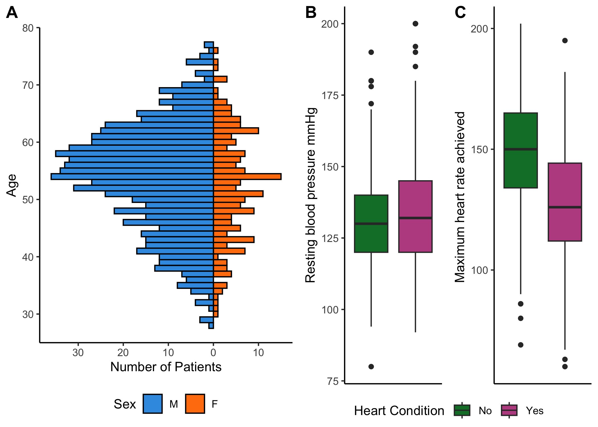

Heart Failure Prediction
================
2024-09-19

``` r
library(ggplot2)
library(hrbrthemes)
library(scales)
library(waffle)
library(ggthemes)
library(dplyr)
library(patchwork)
library(gridExtra)
library(ggpubr)
library(skimr)
library(corrplot)
library(caret) 
library(olsrr)
```

# Data importation and curation

``` r
data = read.csv("/Users/antonin/Documents/Github/Heart_Failure_Prediction_with_R/data/heart.csv", stringsAsFactors = T)
data$HeartDisease <- as.factor(data$HeartDisease)
data$FastingBS <- as.factor(data$FastingBS)
data$Cholesterol <- NULL 
```

The Cholesterol column bas been removed because many 0 within population
with Heart disease. Biologically, a Cholesterol level cannot be equal to
0, probably NAs values that have been replaced with 0.

To use this column next time, a benchmarking has to be done with the
different models created with the following options :

- Rows with Cholesterol = 0 removed.  
- Replace 0 values with the mean.  
- Replace 0 with the median.  
- Replace 0 values using the k-mean algorithm.

Observe prediction results and choose the best option.

``` r
skim(data)
```

|                                                  |      |
|:-------------------------------------------------|:-----|
| Name                                             | data |
| Number of rows                                   | 918  |
| Number of columns                                | 11   |
| \_\_\_\_\_\_\_\_\_\_\_\_\_\_\_\_\_\_\_\_\_\_\_   |      |
| Column type frequency:                           |      |
| factor                                           | 7    |
| numeric                                          | 4    |
| \_\_\_\_\_\_\_\_\_\_\_\_\_\_\_\_\_\_\_\_\_\_\_\_ |      |
| Group variables                                  | None |

Data summary

**Variable type: factor**

| skim_variable  | n_missing | complete_rate | ordered | n_unique | top_counts                           |
|:---------------|----------:|--------------:|:--------|---------:|:-------------------------------------|
| Sex            |         0 |             1 | FALSE   |        2 | M: 725, F: 193                       |
| ChestPainType  |         0 |             1 | FALSE   |        4 | ASY: 496, NAP: 203, ATA: 173, TA: 46 |
| FastingBS      |         0 |             1 | FALSE   |        2 | 0: 704, 1: 214                       |
| RestingECG     |         0 |             1 | FALSE   |        3 | Nor: 552, LVH: 188, ST: 178          |
| ExerciseAngina |         0 |             1 | FALSE   |        2 | N: 547, Y: 371                       |
| ST_Slope       |         0 |             1 | FALSE   |        3 | Fla: 460, Up: 395, Dow: 63           |
| HeartDisease   |         0 |             1 | FALSE   |        2 | 1: 508, 0: 410                       |

**Variable type: numeric**

| skim_variable | n_missing | complete_rate |   mean |    sd |   p0 | p25 |   p50 |   p75 |  p100 | hist  |
|:--------------|----------:|--------------:|-------:|------:|-----:|----:|------:|------:|------:|:------|
| Age           |         0 |             1 |  53.51 |  9.43 | 28.0 |  47 |  54.0 |  60.0 |  77.0 | ▁▅▇▆▁ |
| RestingBP     |         0 |             1 | 132.40 | 18.51 |  0.0 | 120 | 130.0 | 140.0 | 200.0 | ▁▁▃▇▁ |
| MaxHR         |         0 |             1 | 136.81 | 25.46 | 60.0 | 120 | 138.0 | 156.0 | 202.0 | ▁▃▇▆▂ |
| Oldpeak       |         0 |             1 |   0.89 |  1.07 | -2.6 |   0 |   0.6 |   1.5 |   6.2 | ▁▇▆▁▁ |

``` r
summary(data$RestingBP)
```

    ##    Min. 1st Qu.  Median    Mean 3rd Qu.    Max. 
    ##     0.0   120.0   130.0   132.4   140.0   200.0

Minimum 0 as repos resting mean the person is death, we can presume an
anomali in the data. Let’s check how many rows are concerned.

``` r
data[data$RestingBP == 0,]
```

    ##     Age Sex ChestPainType RestingBP FastingBS RestingECG MaxHR ExerciseAngina
    ## 450  55   M           NAP         0         0     Normal   155              N
    ##     Oldpeak ST_Slope HeartDisease
    ## 450     1.5     Flat            1

Only one, let’s replace its value with the mean of the other row to fix
that.

``` r
data[450,"RestingBP"] <- mean(data$RestingBP[-450])
```

# Visual representation of the data

Code of the differents plots. Click to expand.

``` r
######################

# Age distribution by Sex 
data_summary <- data %>%
  group_by(Age, Sex) %>%
  summarise(Count = n(), .groups = 'drop')

age_distribution_sex <- ggplot(data_summary, aes(x = Age, y = ifelse(Sex == "M", -Count, Count), fill = Sex, width=1)) +
  geom_bar(stat="identity", color="#000000") +
  coord_flip() + 
  scale_y_continuous(labels = abs) + 
  labs(title = "", x = "Age", y = "Number of Patients") +
  scale_fill_manual(values = c("M" = "#399ce3", "F" = "#ff7f0e")) +
  theme_classic() + 
  guides(fill = guide_legend(reverse = TRUE, position = "bottom"))

######################

# Resting electrocardiogram results
data$RestingECG <- factor(data$RestingECG, levels = c("ST", "LVH", "Normal"))

resting_ecg_plot <- ggplot(data, aes(x=HeartDisease, fill=RestingECG)) + 
    geom_bar(color = "black", position="fill") + 
    theme_classic() + 
    scale_y_continuous(labels = scales::percent) +
    ylab("") + 
    scale_fill_manual(name = "", values = c("Normal" = "#446455", "LVH" = "#FDD262", "ST" = "#D3DDDC" ), label = c("ST" = "ST-T wave abnormality", "LVH" = "Left ventricular hypertrophy")) +
    scale_x_discrete(labels=c('No Heart Disease', 'Heart Disease')) +
    theme(axis.title.x=element_blank(),
        axis.ticks.x=element_blank(),
        axis.text.x = element_text(angle = 90, vjust = 0.5, hjust=1),
        legend.position = "top") +
    guides(fill=guide_legend(nrow=3,byrow=TRUE))

######################

# Chest pain type 
data$ChestPainType <- factor(data$ChestPainType, levels = c("TA", "ATA", "NAP", "ASY"))

chest_pain_plot <- ggplot(data, aes(x=HeartDisease, fill=ChestPainType)) + 
    geom_bar(color = "black", position="fill") + 
    theme_classic() + 
    scale_y_continuous(labels = scales::percent) +
    ylab("") + 
    scale_fill_manual(name = "", values = c("ASY" = "#446455", "NAP" = "#FDD262", "ATA" = "#D3DDDC", "TA" = "#C7B19C"),
                      label = c("ASY" = "Asymptomatic", "NAP" = "Non-Anginal Pain", "ATA" = "Atypical Angina", "TA" = "Typical Angina", ""))+
    scale_x_discrete(labels=c('No Heart Disease', 'Heart Disease')) +
    theme(axis.title.x=element_blank(),
        axis.ticks.x=element_blank(),
        axis.text.x = element_text(angle = 90, vjust = 0.5, hjust=1),
        legend.position = "top") +
    guides(fill=guide_legend(nrow=4,byrow=TRUE))

######################

# Resting blood pressure
custom_colors <- c("#0c7d34", "#bc5090")
restingBP_boxplot <- ggplot(data, aes(x=HeartDisease, y=RestingBP, fill = HeartDisease)) + 
    geom_boxplot() + 
    ylab("Resting blood pressure mmHg") + 
    scale_fill_manual(name = "Heart Condition", values = custom_colors, labels = c("No", "Yes")) +
    theme_classic() + 
    theme(legend.position = "bottom", 
          axis.title.x=element_blank(),
          axis.text.x=element_blank(),
          axis.ticks.x=element_blank())

######################

# Maximum heart rate achieved
max_heart_rate_boxplot <- ggplot(data, aes(x=HeartDisease, y=MaxHR, fill = HeartDisease)) + 
    geom_boxplot() + 
    scale_fill_manual(name = "Heart Condition", values = custom_colors, labels = c("No", "Yes")) +
    theme_classic() + 
    ylab("Maximum heart rate achieved ") + 
    theme(legend.position = "bottom", 
          axis.title.x=element_blank(),
          axis.text.x=element_blank(),
          axis.ticks.x=element_blank())

######################
# Slope of the peak exercise ST segment
st_slope_plot <- ggplot(data, aes(x=HeartDisease, fill=ST_Slope)) + 
    geom_bar(color = "black", position="fill") + 
    theme_classic() + 
    scale_y_continuous(labels = scales::percent) +
    ylab("") + 
    scale_fill_manual(name = "", values = c("Up" = "#446455", "Flat" = "#FDD262", "Down" = "#D3DDDC" ), label = c("Up" = "Upsloping", "Down" = "Downsloping")) +
    scale_x_discrete(labels=c('No Heart Disease', 'Heart Disease')) +
    theme(axis.title.x=element_blank(),
        axis.ticks.x=element_blank(),
        axis.text.x = element_text(angle = 90, vjust = 0.5, hjust=1),
        legend.position = "top") +
    guides(fill=guide_legend(nrow=3,byrow=TRUE))

######################
# Fasting blood sugar
  ## No Heart Disease samples
fasting_normal <- data[data$HeartDisease == "0",]$FastingBS
fasting_normal <- data.frame("Heart Condition" = fasting_normal)

palette <- c("#0c7d34", "#bc5090")

fasting_plot_0 <- ggplot(fasting_normal, aes(x = Heart.Condition, fill = Heart.Condition)) +
  geom_bar(colour = "black") +
  theme_classic() + 
  ylim(0,375) +
  ylab("Patients with fasting blood sugar <= 120 mg/dl") +
  scale_fill_manual(name = "Heart Condition", values = palette, labels = c("No", "Yes")) +
  theme(plot.title = element_text(hjust = 0.5, size = 7),
        axis.title.x=element_blank(),
        axis.text.x=element_blank(),
        axis.ticks.x=element_blank(),
        legend.position = "bottom")

  ## Heart Disease samples
fasting_disease <- data[data$HeartDisease == "1",]$FastingBS
fasting_disease <- data.frame("Heart Condition" = fasting_disease)

fasting_plot_1 <- ggplot(fasting_disease, aes(x = Heart.Condition, fill = Heart.Condition)) +
  geom_bar(colour = "black") +
  theme_classic() + 
  ylim(0,375) +
  ylab("Patients with fasting blood sugar > 120 mg/dl") +
  scale_fill_manual(name = "Heart Condition", values = palette, labels = c("No", "Yes")) +
  theme(plot.title = element_text(hjust = 0.5, size = 7),
        axis.title.x=element_blank(),
        axis.text.x=element_blank(),
        axis.ticks.x=element_blank(),
        legend.position = "bottom")

# Exercice Angina
  ## No Heart Disease samples
exercice_angina_0 <- data[data$HeartDisease == "0",]$ExerciseAngina
exercice_angina_0 <- data.frame("Heart Condition" = exercice_angina_0)

palette <- c("#0c7d34", "#bc5090")

exercice_angina_plot_0 <- ggplot(exercice_angina_0, aes(x = Heart.Condition, fill = Heart.Condition)) +
  geom_bar(colour = "black") +
  ylim(0,375) +
  ylab("Patients without exercise-induced angina") + 
  theme_classic() + 
  scale_fill_manual(name = "Heart Condition", values = palette, labels = c("No", "Yes")) +
  theme(plot.title = element_text(hjust = 0.5, size = 7),
        axis.title.x=element_blank(),
        axis.text.x=element_blank(),
        axis.ticks.x=element_blank(),
        legend.position = "bottom")

  ## Heart Disease samples
exercice_angina_1 <- data[data$HeartDisease == "1",]$FastingBS
exercice_angina_1 <- data.frame("Heart Condition" = exercice_angina_1)

exercice_angina_plot_1 <- ggplot(exercice_angina_1, aes(x = Heart.Condition, fill = Heart.Condition)) +
  geom_bar(colour = "black") + 
  ylim(0,375) +
  ylab("Patients with exercise-induced angina") + 
  theme_classic() + 
  scale_fill_manual(name = "Heart Condition", values = palette, labels = c("No", "Yes")) +
  theme(plot.title = element_text(hjust = 0.5, size = 7),
        axis.title.x=element_blank(),
        axis.text.x=element_blank(),
        axis.ticks.x=element_blank(),
        legend.position = "bottom")

######################
# OldPeak - Numeric value measured in depression
palette <- c("#0c7d34", "#bc5090")

Oldpeak_0 <- data.frame(data$Oldpeak, data$HeartDisease)

Oldpeak_plot <- ggplot(data=Oldpeak_0, aes(x=data.Oldpeak, group=data.HeartDisease, fill=data.HeartDisease)) +
    geom_density(adjust=1, alpha=0.5) +
    theme_classic() + 
    scale_fill_manual(name = "Heart Condition", values = palette) + 
    labs(title = "", x = "ST depression value mesured", y = "") +
    theme(plot.title = element_text(hjust = 0.5)) + 
    scale_fill_manual(name = "Heart Condition", values = custom_colors, labels = c("No", "Yes"))

######################
# Merge plots

boxplots <- ggarrange(restingBP_boxplot, max_heart_rate_boxplot, ncol=2, nrow=1, common.legend = TRUE, legend="bottom", labels = c("B", "C")) 
fasting <- ggarrange(fasting_plot_0, fasting_plot_1, ncol=3, nrow=1, common.legend = TRUE, legend="none")
angina <- ggarrange(exercice_angina_plot_0, exercice_angina_plot_1, ncol=2, nrow=1, common.legend = TRUE, legend="right")
```

**Figures**:

- **A.** Age distribution by sex
- **B.** Resting blood pressure \[mm Hg\]
- **C.** Maximum heart rate achieved \[Beats per minute\]
- **D.** Count of patients with fasting blood sugar above and below 120
  mg/dl
- **E.** Count of patients with and without exercise-induced angina
- **F.** Distribution of chest pain type (%)
- **G.** Distribution of resting electrocardiogram results \[Normal:
  Normal, ST: having ST-T wave abnormality (T wave inversions and/or ST
  elevation or depression of \> 0.05 mV), LVH: showing probable or
  definite left ventricular hypertrophy by Estes’ criteria\] (%)
- **H.** Distribution of the slope of the peak exercise ST segment (%)
- **I.** Density of oldpeak ST \[Numeric value measured in depression\]

``` r
# Adding labels
ggarrange(age_distribution_sex, boxplots, ncol = 2, nrow = 1, labels = c("A"))
```

<!-- -->

``` r
ggarrange(fasting, angina, ncol=2, nrow=1, labels = c("D", "E")) 
```

<!-- -->

``` r
ggarrange(chest_pain_plot, resting_ecg_plot, st_slope_plot, ncol=3, nrow=1, labels = c("F", "G", "H"))
```

<!-- -->

``` r
ggarrange(Oldpeak_plot, ncol=1, nrow=1, labels = c("I"))
```

<!-- -->

At first glance, we can clearly see a surepresentation of Male within
the data, and a sample age tending toward 55 years old (Fig. A). The
boxplot showing the resting blood pressure (Fig. B) doesn’t visually
give the impression having a link with heart diseases, contrary to the
plot of the maximum heart rate achieved (Fig. C). To confirm or infirm
our observation, we can statistically prove or not the correlation.

Before that, we have to test if the Resting blood pressure results and
maximum heart rate achieved follow a normal distribution.

``` r
shapiro.test(data$RestingBP) 
```

    ## 
    ##  Shapiro-Wilk normality test
    ## 
    ## data:  data$RestingBP
    ## W = 0.97127, p-value = 1.743e-12

``` r
shapiro.test(data$MaxHR)
```

    ## 
    ##  Shapiro-Wilk normality test
    ## 
    ## data:  data$MaxHR
    ## W = 0.99267, p-value = 0.0001683

Both p-value are below 0.05, so we can conclude they do not follow a
normal distribution, and we will have to perform non-parametric
correlation test (Spearman).

``` r
cor.test(data$RestingBP, as.numeric(data$HeartDisease), method = "spearman", exact = FALSE)
```

    ## 
    ##  Spearman's rank correlation rho
    ## 
    ## data:  data$RestingBP and as.numeric(data$HeartDisease)
    ## S = 113979002, p-value = 0.0004284
    ## alternative hypothesis: true rho is not equal to 0
    ## sample estimates:
    ##       rho 
    ## 0.1160075

``` r
cor.test(data$MaxHR, as.numeric(data$HeartDisease), method = "spearman", exact = FALSE)
```

    ## 
    ##  Spearman's rank correlation rho
    ## 
    ## data:  data$MaxHR and as.numeric(data$HeartDisease)
    ## S = 181133616, p-value < 2.2e-16
    ## alternative hypothesis: true rho is not equal to 0
    ## sample estimates:
    ##        rho 
    ## -0.4048268

The hypothesis H0 for cor.test is : There is no association between the
two variables. However, in both case, p-value \< 0.05, so we rejet the
nul hypothesis. It can be concluded that both RestingBP and MaxHR do
have a correclation with heart diseases. The correlation coefficient is
around 0.12 for RestingBP, and -0.40 for MaxHR. Therefore, MaxHR has a
higher impact on heart diseases than RestingBP.

A higher amount of patients can be seen with high fasting blood sugar
\[\>120 mg/dl\] and exercice-induces angina among heart disease victims
(Fig. D and Fig. E), both could be an important factor.

From Fig. F, patients affected by heart diseases don’t have any chest
pain (asymptomatic) and generally a flat slope of the peak exercise
(Fig. H).

Finally, Fig. I indicates that most of the patients without heart
condition hasn’t ST depression on their electrocardiogram results, when
the ST segment is abnormally low below the baseline, it could be linked
with heart diseases.

To have a better understanding if some variable are correlated between
each others, we can generate a correlation matrix and observe the
correlation values between each conditions.

``` r
######################
# Correlation matrix

table <- data.frame(as.numeric(data$Sex), data$Age, data$RestingBP, data$MaxHR, data$Oldpeak, as.numeric(data$FastingBS), as.numeric(data$ExerciseAngina), as.numeric(data$RestingECG))
names(table) <- c("Sex", "Age", "Resting BP", "Max HR", "Oldpeak", "FastingBS", "Exercice Angina", "Resting ECG")
red <- cor(table)
correlation_matrix <- corrplot(red, method="color", type="lower", addCoef.col = T,
         col = colorRampPalette(c("#446455", "#FDD262", "#D3DDDC"))(100),
         tl.col = "black", tl.srt = 45)
```

<!-- -->

# Machine learning models

## Data train & data test

``` r
data <- data %>%
  mutate(HeartDisease = ifelse(HeartDisease == "1", TRUE, FALSE))
```

Before training any model, the dataset has to be split in two, 80% of
the dataset will be used to train the model, and the other 20% will
serve to test it.

``` r
eighty_percents <- round(nrow(data) * 0.2)  # Calculate how many sample represent 20% of the dataset
choice <-  sample(1:nrow(data), size = eighty_percents, replace = F) # Randomly selecting 20% of the number of patient

data.test <- data[choice, ] # Keep 20% of the dataset
data.train <- data[-choice,] # Keep the other 80% of the dataset
```

## Linear regression

``` r
linear_reg_all <- lm(HeartDisease ~ ., data = data.train)
```

``` r
data.test$pred = predict(linear_reg_all, data.test) > 0.5
confusion_matrix_linear_reg_all <- table(data.test$HeartDisease, data.test$pred)
(confusion_matrix_linear_reg_all[1,1] + confusion_matrix_linear_reg_all[2,2]) / sum(confusion_matrix_linear_reg_all) * 100
```

    ## [1] 84.78261

``` r
stats_linear_reg_all <- confusionMatrix(confusion_matrix_linear_reg_all)

stats_linear_reg_all$overall
```

    ##       Accuracy          Kappa  AccuracyLower  AccuracyUpper   AccuracyNull 
    ##   8.478261e-01   6.811881e-01   7.876304e-01   8.964375e-01   6.304348e-01 
    ## AccuracyPValue  McnemarPValue 
    ##   6.080541e-11   1.858767e-01

``` r
stats_linear_reg_all$byClass
```

    ##          Sensitivity          Specificity       Pos Pred Value 
    ##            0.8529412            0.8448276            0.7631579 
    ##       Neg Pred Value            Precision               Recall 
    ##            0.9074074            0.7631579            0.8529412 
    ##                   F1           Prevalence       Detection Rate 
    ##            0.8055556            0.3695652            0.3152174 
    ## Detection Prevalence    Balanced Accuracy 
    ##            0.4130435            0.8488844

The best model isn’t necessary the one with the best accuracy, because
it’s gonna be always one with all the factors, we can try to simplify as
much as we can the model by removing the factor not bringing enough
information to help for the prediction.

From the package `olsrr` (similar to `leaps`), the funcion
ols_step_best_subset will perform all the combination and return the
best predictors. The Mallows’s C(p) is a good indicator to know which
model choose at the end, balancing between complexity and accuracy.

``` r
ols_step_best_subset(linear_reg_all)
```

    ##                                          Best Subsets Regression                                         
    ## ---------------------------------------------------------------------------------------------------------
    ## Model Index    Predictors
    ## ---------------------------------------------------------------------------------------------------------
    ##      1         ST_Slope                                                                                   
    ##      2         ChestPainType ST_Slope                                                                     
    ##      3         Sex ChestPainType ST_Slope                                                                 
    ##      4         Sex ChestPainType ExerciseAngina ST_Slope                                                  
    ##      5         Sex ChestPainType FastingBS ExerciseAngina ST_Slope                                        
    ##      6         Sex ChestPainType FastingBS ExerciseAngina Oldpeak ST_Slope                                
    ##      7         Age Sex ChestPainType FastingBS ExerciseAngina Oldpeak ST_Slope                            
    ##      8         Age Sex ChestPainType FastingBS MaxHR ExerciseAngina Oldpeak ST_Slope                      
    ##      9         Age Sex ChestPainType FastingBS RestingECG MaxHR ExerciseAngina Oldpeak ST_Slope           
    ##     10         Age Sex ChestPainType RestingBP FastingBS RestingECG MaxHR ExerciseAngina Oldpeak ST_Slope 
    ## ---------------------------------------------------------------------------------------------------------
    ## 
    ##                                                      Subsets Regression Summary                                                     
    ## ------------------------------------------------------------------------------------------------------------------------------------
    ##                        Adj.        Pred                                                                                              
    ## Model    R-Square    R-Square    R-Square      C(p)        AIC          SBIC         SBC         MSEP       FPE       HSP      APC  
    ## ------------------------------------------------------------------------------------------------------------------------------------
    ##   1        0.3836      0.3819      0.3782    314.4752    712.3073    -1374.0533    730.7013    112.4948    0.1539    2e-04    0.6197 
    ##   2        0.4968      0.4933      0.4871    129.0850    569.4219    -1520.4432    601.6115     91.9675    0.1263    2e-04    0.5073 
    ##   3        0.5253      0.5214      0.5146     82.8361    528.5846    -1561.1178    565.3727     86.8727    0.1195    2e-04    0.4799 
    ##   4        0.5463      0.5419      0.5345     49.3795    497.4305    -1592.0101    538.8171     83.1501    0.1145    2e-04    0.4599 
    ##   5        0.5642      0.5594      0.5517     21.0484    469.8298    -1619.2216    515.8149     79.9734    0.1103    2e-04    0.4430 
    ##   6        0.5711      0.5658      0.5575     11.3831    460.1198    -1628.7159    510.7034     78.8161    0.1089    1e-04    0.4371 
    ##   7        0.5741      0.5682      0.5592      8.4061    457.0663    -1631.6342    512.2484     78.3833    0.1084    1e-04    0.4353 
    ##   8        0.5746      0.5681      0.5583      9.5324    458.1756    -1630.4650    517.9562     78.3964    0.1086    1e-04    0.4360 
    ##   9        0.5748      0.5671      0.5558     13.1750    461.8110    -1628.7794    530.7886     78.4658    0.1090    1e-04    0.4370 
    ##  10        0.5749      0.5666      0.5545     15.0000    463.6323    -1626.9114    537.2084     78.5554    0.1092    1e-04    0.4380 
    ## ------------------------------------------------------------------------------------------------------------------------------------
    ## AIC: Akaike Information Criteria 
    ##  SBIC: Sawa's Bayesian Information Criteria 
    ##  SBC: Schwarz Bayesian Criteria 
    ##  MSEP: Estimated error of prediction, assuming multivariate normality 
    ##  FPE: Final Prediction Error 
    ##  HSP: Hocking's Sp 
    ##  APC: Amemiya Prediction Criteria

The best model following Mallows’s C(p) include only the OldPeak factor
instead of the 10 of the previous model.

``` r
linear_reg_1 <- lm(HeartDisease ~ ST_Slope, data = data.train)

data.test$pred = predict(linear_reg_1, data.test) > 0.5
confusion_matrix_linear_reg_1 <- table(data.test$HeartDisease, data.test$pred)

stats_linear_reg_1 <- confusionMatrix(confusion_matrix_linear_reg_1)

stats_linear_reg_1$overall
```

    ##       Accuracy          Kappa  AccuracyLower  AccuracyUpper   AccuracyNull 
    ##   8.260870e-01   6.327345e-01   7.634499e-01   8.778980e-01   6.521739e-01 
    ## AccuracyPValue  McnemarPValue 
    ##   1.339413e-07   5.182993e-02

``` r
stats_linear_reg_1$byClass
```

    ##          Sensitivity          Specificity       Pos Pred Value 
    ##            0.8437500            0.8166667            0.7105263 
    ##       Neg Pred Value            Precision               Recall 
    ##            0.9074074            0.7105263            0.8437500 
    ##                   F1           Prevalence       Detection Rate 
    ##            0.7714286            0.3478261            0.2934783 
    ## Detection Prevalence    Balanced Accuracy 
    ##            0.4130435            0.8302083

The performances statistics of the model are quite similar to the
previous one while removing 9 factors.
